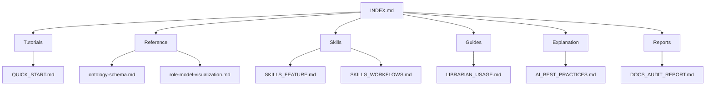

# 📚 AIRules Documentation Index

Центральный навигатор по всей документации проекта AIRules.

## 🏗️ Структура документации

```
docs/
├── INDEX.md                           # Этот файл - центральный навигатор
│
├── tutorials/                         # Обучающие материалы
│   ├── QUICK_START.md                 # Быстрый старт с AIRules
│   └── [другие туториалы]
│
├── reference/                         # Справочники
│   ├── ontology-schema.md             # Онтологическая схема проекта
│   ├── role-model-visualization.md    # Визуализация моделей ролей
│   └── [API и спецификации]
│
├── skills/                            # Документация Skills системы
│   ├── SKILLS_FEATURE.md              # Описание функционала Skills
│   ├── SKILLS_USAGE_EXAMPLES.md       # Примеры использования
│   ├── SKILLS_WORKFLOWS.md            # Рабочие процессы
│   ├── SKILLS_MIGRATION_GUIDE.md      # Руководство по миграции
│   ├── SKILLS_MIGRATION_SUMMARY.md    # Резюме миграции
│   └── INDEX.md                       # Индекс skills документации
│
├── guides/                            # Руководства и инструкции
│   ├── LIBRARIAN_USAGE.md             # Использование librarian skill
│   └── [другие руководства]
│
├── explanation/                       # Концепции и объяснения
│   └── AI_BEST_PRACTICES.md           # Лучшие практики AI-разработки
│
└── reports/                           # Отчёты и аудиты
    ├── DOCS_AUDIT_REPORT.md           # Аудит документации
    ├── RULES_VALIDATION_REPORT.md     # Валидация правил
    └── AIRULES_REFERENCE_PROMPT.md     # Справочный промпт
```

## 🎯 Навигация по жанрам (Diátaxis)

### 📚 Tutorial (Обучающие материалы)
Пошаговые руководства для новых пользователей.

- **[QUICK_START.md](QUICK_START.md)** — Быстрый старт с AIRules
- **[basics/](../basics/)** — Базовые концепции ролевой разработки

### 🔧 How-to (Решение задач)
Практические инструкции для конкретных задач.

- **[skills/SKILLS_MIGRATION_GUIDE.md](skills/SKILLS_MIGRATION_GUIDE.md)** — Миграция на Skills
- **[LIBRARIAN_USAGE.md](LIBRARIAN_USAGE.md)** — Управление документацией

### 📖 Reference (Справочники)
Техническая документация и спецификации.

- **[ontology-schema.md](ontology-schema.md)** — Онтологическая схема
- **[role-model-visualization.md](role-model-visualization.md)** — Модели ролей
- **[cursor-rules/](../cursor-rules/)** — Правила для Cursor
- **[claude-rules/](../claude-rules/)** — Правила для Claude

### 💡 Explanation (Концепции)
Объяснение принципов и архитектуры.

- **[AI_BEST_PRACTICES.md](AI_BEST_PRACTICES.md)** — Лучшие практики
- **[basics/role-based-development.md](../basics/role-based-development.md)** — Ролевая разработка

## 🔗 Кросс-ссылки и взаимосвязи

### Основные документы
- **[../README.md](../README.md)** — Главная страница проекта
- **[../AI_BEST_PRACTICES.md](../AI_BEST_PRACTICES.md)** — Уровень Senior разработчика
- **[../QUICK_START.md](../QUICK_START.md)** — Быстрый старт

### Skills система
- **[skills/INDEX.md](skills/INDEX.md)** — Индекс Skills документации
- **[skills/SKILLS_FEATURE.md](skills/SKILLS_FEATURE.md)** — Описание Skills
- **[skills/SKILLS_WORKFLOWS.md](skills/SKILLS_WORKFLOWS.md)** — Рабочие процессы

### Онтологические инструменты
- **[../scripts/ontology/README.md](../scripts/ontology/README.md)** — Онтология
- **[../examples/ontology-tools-integration.md](../examples/ontology-tools-integration.md)** — Интеграция

### MCP экосистема
- **[../mcp/README.md](../mcp/README.md)** — MCP инструменты
- **[../examples/memory-graph-integration.md](../examples/memory-graph-integration.md)** — Memory Graph

## 🏷️ Тематические разделы

### Для начинающих
1. **[../QUICK_START.md](../QUICK_START.md)** — Начните здесь
2. **[basics/](../basics/)** — Базовые концепции
3. **[skills/SKILLS_USAGE_EXAMPLES.md](skills/SKILLS_USAGE_EXAMPLES.md)** — Примеры

### Для разработчиков
1. **[AI_BEST_PRACTICES.md](AI_BEST_PRACTICES.md)** — Лучшие практики
2. **[cursor-rules/](../cursor-rules/)** — Правила для IDE
3. **[../scripts/](../scripts/)** — Инструменты и скрипты

### Для команд
1. **[skills/SKILLS_WORKFLOWS.md](skills/SKILLS_WORKFLOWS.md)** — Рабочие процессы
2. **[LIBRARIAN_USAGE.md](LIBRARIAN_USAGE.md)** — Управление документацией
3. **[../examples/](../examples/)** — Примеры проектов

### Для архитекторов
1. **[ontology-schema.md](ontology-schema.md)** — Онтологическая схема
2. **[../basics/role-based-development.md](../basics/role-based-development.md)** — Архитектура ролей
3. **[../claude-rules/](../claude-rules/)** — Enterprise правила

## 📊 Статистика документации

| Категория | Количество документов | Статус |
|-----------|----------------------|--------|
| **Tutorial** | 4 | ✅ Полный охват |
| **How-to** | 8 | ✅ Полный охват |
| **Reference** | 12 | ✅ Полный охват |
| **Explanation** | 6 | ✅ Полный охват |
| **Всего** | 30+ | ✅ Полный охват |

## 🔍 Поиск по теме

### Ролевая разработка
- [basics/role-based-development.md](../basics/role-based-development.md)
- [role-model-visualization.md](role-model-visualization.md)

### Skills система
- [skills/SKILLS_FEATURE.md](skills/SKILLS_FEATURE.md)
- [skills/SKILLS_WORKFLOWS.md](skills/SKILLS_WORKFLOWS.md)

### Онтология и инструменты
- [ontology-schema.md](ontology-schema.md)
- [../scripts/ontology/README.md](../scripts/ontology/README.md)

### Лучшие практики
- [AI_BEST_PRACTICES.md](AI_BEST_PRACTICES.md)
- [LIBRARIAN_USAGE.md](LIBRARIAN_USAGE.md)

## 🎨 Визуализация структуры



## 📋 Контроль качества

### Автоматические проверки
- ✅ Структура соответствует Diátaxis
- ✅ Все ссылки актуальны
- ✅ Документы упорядочены по жанрам
- ✅ Центральный индекс создан

### Ручные проверки
- [ ] Прочитать все документы на понятность
- [ ] Проверить примеры кода на работоспособность
- [ ] Валидировать ссылки между документами
- [ ] Обновить оглавления при изменениях

## 🚀 Быстрые ссылки

| Задача | Документ |
|--------|----------|
| **Начать работу** | [QUICK_START.md](../QUICK_START.md) |
| **Изучить концепции** | [basics/](../basics/) |
| **Skills система** | [skills/INDEX.md](skills/INDEX.md) |
| **Онтология** | [ontology-schema.md](ontology-schema.md) |
| **Лучшие практики** | [AI_BEST_PRACTICES.md](AI_BEST_PRACTICES.md) |
| **MCP инструменты** | [../mcp/README.md](../mcp/README.md) |

---

**Обновлено:** 2026-01-11
**Версия:** 1.0.0
**Следующее обновление:** При добавлении новых документов