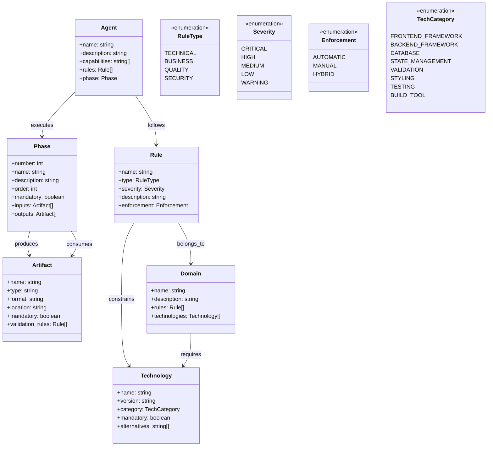

# Онтологическая схема ролевой модели HomeAccounting 🤖

## Обзор онтологии

Онтология представляет собой формализованную модель знаний для многоагентной системы разработки. Она описывает концепты, отношения и правила взаимодействия агентов в процессе создания программного обеспечения.



## Детальная структура онтологии

### 1. Агенты (Agents)

```yaml
Agent:
  subclasses:
    - Architect
    - Executor
    - Validator
    - Specialist

  properties:
    - name: string (required)
    - description: string (required)
    - capabilities: string[] (required)
    - rules: Rule[] (required)
    - phase: Phase (required)
    - context_files: string[] (optional)

  instances:
    - architect: "Создает технические задания"
    - nextjs_executor: "Реализует код на Next.js"
    - validator: "Проверяет качество кода"
    - import_specialist: "Обрабатывает импорт данных"
    - qa_tester: "Проводит E2E тестирование"
    - account_auditor: "Аудитирует бухгалтерскую логику"
    - refactoring_auditor: "Анализирует код на улучшения"
    - context7_researcher: "Ищет актуальную документацию"
```

### 2. Фазы (Phases)

```yaml
Phase:
  properties:
    - number: int (required, 1-7)
    - name: string (required)
    - description: string (required)
    - order: int (required)
    - mandatory: boolean (required)
    - inputs: Artifact[] (optional)
    - outputs: Artifact[] (required)
    - agent: Agent (required)
    - next_phase: Phase (optional)
    - error_handling: ErrorHandler (optional)

  instances:
    - phase_1:
        number: 1
        name: "Architect"
        mandatory: true
        agent: architect
        outputs: ["docs/PLAN.md"]
        next_phase: phase_2

    - phase_2:
        number: 2
        name: "Next.js Executor"
        mandatory: true
        agent: nextjs_executor
        inputs: ["docs/PLAN.md"]
        outputs: ["source_code", "docs/DEBUG_REPORT.md"]
        next_phase: phase_3

    - phase_3:
        number: 3
        name: "Validator"
        mandatory: true
        agent: validator
        inputs: ["source_code", "docs/PLAN.md"]
        outputs: ["validation_report"]
        next_phase: phase_4

    - phase_4:
        number: 4
        name: "Import Specialist"
        mandatory: false
        agent: import_specialist
        condition: "requires_data_import"
        outputs: ["docs/IMPORT_REPORT.md"]

    - phase_5:
        number: 5
        name: "QA Tester"
        mandatory: false
        agent: qa_tester
        condition: "requires_e2e_testing"
        outputs: ["docs/QA_REPORT.md"]

    - phase_6:
        number: 6
        name: "Account Auditor"
        mandatory: true
        agent: account_auditor
        condition: "financial_operations"
        outputs: ["docs/ACCOUNT_AUDIT_REPORT.md"]

    - phase_7:
        number: 7
        name: "Refactoring Auditor"
        mandatory: false
        agent: refactoring_auditor
        condition: "refactoring_requested"
        outputs: ["refactoring_report"]
```

### 3. Артефакты (Artifacts)

```yaml
Artifact:
  subclasses:
    - Document
    - SourceCode
    - Report
    - Configuration

  properties:
    - name: string (required)
    - type: ArtifactType (required)
    - format: string (required)
    - location: string (required)
    - mandatory: boolean (required)
    - validation_rules: Rule[] (optional)
    - schema: object (optional)

  instances:
    - plan_document:
        name: "docs/PLAN.md"
        type: Document
        format: "markdown"
        location: "docs/PLAN.md"
        mandatory: true
        validation_rules: ["has_architecture", "has_tech_stack", "has_implementation_plan"]

    - source_code:
        name: "Source Code"
        type: SourceCode
        format: "typescript"
        location: "src/"
        mandatory: true
        validation_rules: ["typescript_strict", "no_any_types", "jsdoc_required"]

    - validation_report:
        name: "Validation Report"
        type: Report
        format: "markdown"
        location: "docs/VALIDATION_REPORT.md"
        mandatory: true
        validation_rules: ["has_pass_fail_status", "has_detailed_reasons"]
```

### 4. Правила (Rules)

```yaml
Rule:
  subclasses:
    - TechnicalRule
    - BusinessRule
    - QualityRule
    - SecurityRule

  properties:
    - name: string (required)
    - type: RuleType (required)
    - severity: Severity (required)
    - description: string (required)
    - enforcement: Enforcement (required)
    - domain: Domain (optional)
    - condition: string (optional)
    - error_message: string (required)

  instances:
    - tech_stack_rule:
        name: "tech_stack_compliance"
        type: TECHNICAL
        severity: CRITICAL
        description: "Код должен использовать только разрешенные технологии"
        enforcement: AUTOMATIC
        domain: technology
        error_message: "Использована запрещенная технология: {technology}"

    - numeric_types_rule:
        name: "numeric_types_for_money"
        type: BUSINESS
        severity: CRITICAL
        description: "Денежные суммы должны использовать NUMERIC(15,2)"
        enforcement: AUTOMATIC
        domain: accounting
        error_message: "Использован неправильный тип для денег: {type}"

    - pending_balance_rule:
        name: "pending_not_affect_balance"
        type: BUSINESS
        severity: CRITICAL
        description: "Pending транзакции не влияют на баланс"
        enforcement: AUTOMATIC
        domain: accounting
        error_message: "Pending транзакция изменяет баланс"
```

### 5. Домены (Domains)

```yaml
Domain:
  properties:
    - name: string (required)
    - description: string (required)
    - rules: Rule[] (required)
    - technologies: Technology[] (required)
    - artifacts: Artifact[] (optional)

  instances:
    - technology_domain:
        name: "Technology Stack"
        description: "Правила использования технологий"
        rules: ["tech_stack_compliance", "version_constraints"]
        technologies: ["next.js", "react", "supabase", "zustand"]

    - accounting_domain:
        name: "Accounting Logic"
        description: "Бухгалтерские правила и ограничения"
        rules: ["numeric_types_for_money", "pending_not_affect_balance", "credit_card_transfers"]
        technologies: ["decimal.js", "supabase"]
        artifacts: ["ACCOUNTING_CONSTITUTION.md"]

    - quality_domain:
        name: "Code Quality"
        description: "Стандарты качества кода"
        rules: ["typescript_strict", "jsdoc_required", "function_length_limit"]
        technologies: ["typescript", "eslint"]
```

### 6. Технологии (Technologies)

```yaml
Technology:
  properties:
    - name: string (required)
    - version: string (required)
    - category: TechCategory (required)
    - mandatory: boolean (required)
    - alternatives: string[] (optional)
    - constraints: string[] (optional)

  instances:
    - nextjs:
        name: "Next.js"
        version: "15.x"
        category: FRONTEND_FRAMEWORK
        mandatory: true
        constraints: ["no_pages_router", "app_router_only"]

    - react:
        name: "React"
        version: "19.x"
        category: FRONTEND_FRAMEWORK
        mandatory: true
        constraints: ["strict_mode_required"]

    - supabase:
        name: "Supabase"
        version: "2.x"
        category: DATABASE
        mandatory: true
        constraints: ["direct_client_only", "no_prisma"]

    - typescript:
        name: "TypeScript"
        version: "5.x"
        category: BUILD_TOOL
        mandatory: true
        constraints: ["strict_mode", "no_any_types"]
```

## Отношения и аксиомы

### Основные отношения

```owl
# Агент выполняет фазу
Agent ⊑ ∃executes.Phase

# Фаза производит артефакт
Phase ⊑ ∃produces.Artifact

# Фаза потребляет артефакт
Phase ⊑ ∃consumes.Artifact

# Агент следует правилам
Agent ⊑ ∃follows.Rule

# Правило ограничивает технологию
Rule ⊑ ∃constrains.Technology

# Домен содержит правила
Domain ⊑ ∃contains.Rule

# Домен требует технологии
Domain ⊑ ∃requires.Technology
```

### Аксиомы валидации

```owl
# Критические правила всегда применяются автоматически
CriticalRule ⊑ AutomaticEnforcementRule

# Финансовые операции требуют аудита
FinancialOperation ⊑ ∃requires.AccountAuditor

# Новые технологии требуют проверки Context7
NewTechnology ⊑ ∃requires.Context7Researcher

# Ошибки 2+ раза останавливают выполнение
RepeatedError ⊑ ∃triggers.HumanIntervention

# Успешная валидация требует git commit
ValidationPassed ⊑ ∃requires.GitCommit
```

## Контекстные правила

### Rabbit Hole Detection

```yaml
context_rules:
  - name: "error_repetition_detection"
    condition: "same_error_count >= 2"
    action: "stop_execution"
    output: "docs/DEBUG_REPORT.md"
    message: "⛔ ОШИБКА: Зафиксировал проблему. Требуется [архитектурная/человеческая] помощь."

  - name: "validation_failure_handling"
    condition: "validation_result == 'FAILED' AND severity == 'CRITICAL'"
    action: "return_to_phase_2"
    output: "validation_report"
    message: "⛔ VALIDATION FAILED: {reason}. Переписать, используя {correct_approach}."

  - name: "successful_completion"
    condition: "all_phases_passed AND validation_passed"
    action: "git_commit"
    output: "docs/PROJECT_STATE.md"
    message: "✅ VALIDATION PASSED. Задача выполнена корректно."
```

### Автоматические переходы

```yaml
transition_rules:
  - from_phase: 1
    to_phase: 2
    condition: "docs/PLAN.md exists"
    automatic: true

  - from_phase: 2
    to_phase: 3
    condition: "source_code_complete AND eslint_passed"
    automatic: true

  - from_phase: 3
    to_phase: 4
    condition: "validation_passed AND requires_import"
    automatic: false

  - from_phase: 3
    to_phase: 5
    condition: "validation_passed AND requires_testing"
    automatic: false

  - from_phase: 3
    to_phase: 6
    condition: "validation_passed AND financial_operations"
    automatic: true
```

## Визуализация онтологии

```mermaid
graph TB
    subgraph "📋 Концепты"
        A[Agent<br/>Агенты]
        P[Phase<br/>Фазы]
        R[Rule<br/>Правила]
        T[Technology<br/>Технологии]
        D[Domain<br/>Домены]
        Ar[Artifact<br/>Артефакты]
    end

    subgraph "🔗 Отношения"
        A -->|executes| P
        P -->|produces| Ar
        P -->|consumes| Ar
        A -->|follows| R
        R -->|constrains| T
        D -->|contains| R
        D -->|requires| T
    end

    subgraph "⚡ Поведение"
        E[Error<br/>Обработка]
        V[Validation<br/>Валидация]
        Tr[Transition<br/>Переходы]
    end

    R -->|triggers| E
    P -->|validates| V
    P -->|transitions| Tr

    %% Стилизация
    classDef conceptClass fill:#e3f2fd,stroke:#1976d2,stroke-width:2px
    classDef relationClass fill:#f3e5f5,stroke:#7b1fa2,stroke-width:2px
    classDef behaviorClass fill:#fff3e0,stroke:#f57c00,stroke-width:2px

    class A,P,R,T,D,Ar conceptClass
    class relationClass
    class E,V,Tr behaviorClass
```

---

*Онтологическая схема определяет формальную структуру знаний для многоагентной системы разработки HomeAccounting* 📚
