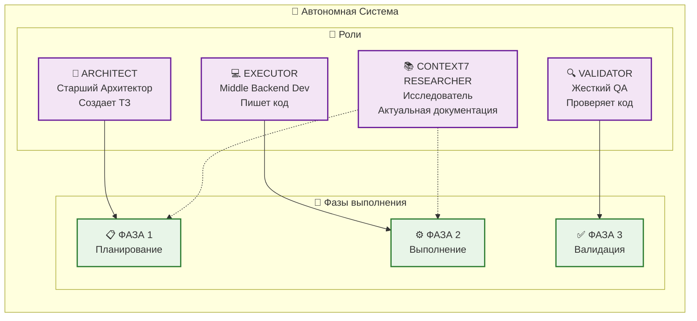
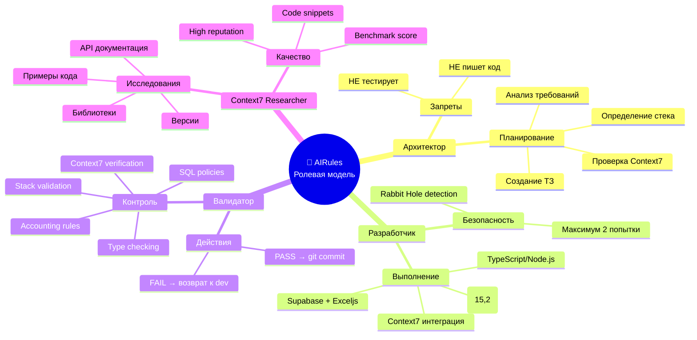
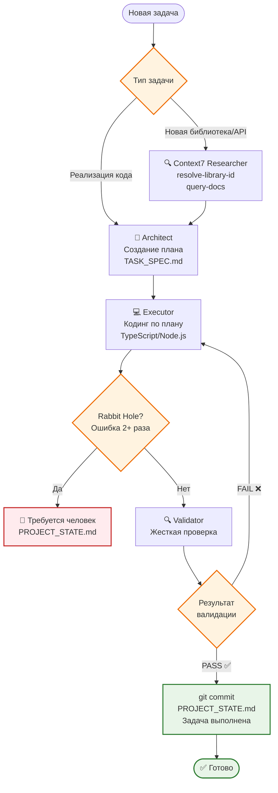

# Визуализация ролевой модели AIRules 🤖

## Диаграмма процесса многоагентной разработки

```mermaid
graph TD
    A[👤 Пользователь<br/>Задача] --> B{Автономный<br/>Режим<br/>Оркестрации}

    B --> C[📋 ФАЗА 1: ARCHITECT<br/>Планирование]

    C --> C1[🔄 Синхронизация<br/>git status<br/>PROJECT_STATE.md<br/>SYSTEM_INSTRUCTION.md<br/>IMPLEMENTATION_PLAN.md]

    C1 --> C2[🔍 Анализ<br/>Проверка конфликтов<br/>Node.js vs Python]

    C2 --> C3[📝 Решение<br/>Создание плана<br/>Технический стек<br/>NUMERIC(15,2)]

    C3 --> C4[📄 Создание<br/>docs/TASK_SPEC.md]

    C4 --> D[⚡ АВТОМАТИЧЕСКИЙ<br/>ПЕРЕХОД]

    D --> E[💻 ФАЗА 2: EXECUTOR<br/>Выполнение]

    E --> E1[📖 Контекст<br/>План из Фазы 1<br/>ACCOUNTING_CONSTITUTION.md]

    E1 --> E2[🔍 Context7<br/>Проверка новых<br/>библиотек/API]

    E2 --> E3[✍️ Кодинг<br/>TypeScript/Node.js<br/>Supabase, Exceljs<br/>NUMERIC(15,2)]

    E3 --> E4{🐰 Rabbit Hole<br/>Detection<br/>Ошибка > 2 раз?}

    E4 -->|Да| E5[⛔ СТОП<br/>PROJECT_STATE.md<br/>Требуется человек]

    E4 -->|Нет| E6[✅ Код готов<br/>git commit]

    E6 --> F[⚡ АВТОМАТИЧЕСКИЙ<br/>ПЕРЕХОД]

    F --> G[🔍 ФАЗА 3: VALIDATOR<br/>Контроль]

    G --> G1[📋 Проверка Checklist<br/>Технологический стек<br/>Типы данных<br/>SQL RLS<br/>Бухгалтерия<br/>Context7 использование]

    G1 --> G2{❌ ОШИБКИ<br/>НАЙДЕНЫ?}

    G2 -->|Да| G3[⛔ VALIDATION FAILED<br/>Возврат к ФАЗЕ 2<br/>Причина ошибки]

    G2 -->|Нет| G4[✅ VALIDATION PASSED<br/>PROJECT_STATE.md<br/>git commit]

    G4 --> H[🎉 ЗАДАЧА<br/>ВЫПОЛНЕНА]

    %% Стилизация
    classDef phaseClass fill:#e1f5fe,stroke:#01579b,stroke-width:2px
    classDef successClass fill:#e8f5e8,stroke:#2e7d32,stroke-width:2px
    classDef errorClass fill:#ffebee,stroke:#c62828,stroke-width:2px
    classDef autoClass fill:#fff3e0,stroke:#ef6c00,stroke-width:2px

    class C,E,G phaseClass
    class G4,H successClass
    class E5,G3 errorClass
    class D,F autoClass
```

## Архитектура ролей



## Детальная карта ответственностей



## Процесс принятия решений



## Легенда и правила

### 🎯 Ключевые принципы
- **3 фазы обязательно** - ARCHITECT → EXECUTOR → VALIDATOR
- **Автоматические переходы** - без вопросов пользователю
- **Жесткая валидация** - FAIL возвращает к EXECUTOR
- **Rabbit Hole защита** - остановка при повторных ошибках

### 📊 Метрики качества
- **Технологический стек**: Node.js only, NUMERIC(15,2), Supabase
- **Бухгалтерские правила**: Expense vs Transfer, кредитная логика
- **Context7 интеграция**: актуальная документация, реальные примеры
- **Безопасность**: нет NEW/OLD в RLS, type safety

### 🚨 Критические правила
- **ЗАПРЕЩЕНО**: Python, Float/Double, устаревшие API
- **ОБЯЗАТЕЛЬНО**: Context7 для новых библиотек
- **АВТОМАТИЧЕСКИ**: переходы между фазами
- **ЖЕСТКО**: отклонение кода при нарушениях

---
*Визуализация создана для демонстрации многоагентной ролевой модели AIRules* 🎨
