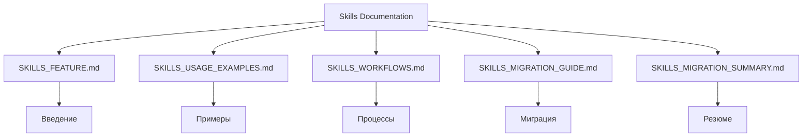

# 🎯 Skills Documentation Index

Централизованный индекс по документации Skills системы AIRules.

## 📋 Обзор Skills системы

**Skills** — это новый функционал Cline, который заменяет и дополняет `.clinerules/` подход для более гибкой работы с LLM.

### 🎯 Что такое Skills?

**Skills** — специализированные роли, которые:
- **Загружаются по требованию** (on-demand) когда запрос соответствует описанию
- **Предоставляют доменную экспертизу** в конкретных областях
- **Работают ВМЕСТЕ с базовыми правилами** из `.clinerules/`
- **Автоматически деактивируются** после выполнения (экономия контекста)

## 📚 Структура документации

```
docs/skills/
├── INDEX.md                           # Этот файл
├── SKILLS_FEATURE.md                  # Описание функционала
├── SKILLS_USAGE_EXAMPLES.md           # Примеры использования
├── SKILLS_WORKFLOWS.md                # Рабочие процессы
├── SKILLS_MIGRATION_GUIDE.md          # Руководство по миграции
└── SKILLS_MIGRATION_SUMMARY.md        # Резюме миграции
```

## 📖 Документы по порядку чтения

### 1. Введение в Skills
**[SKILLS_FEATURE.md](SKILLS_FEATURE.md)** — Основные концепции и преимущества Skills

### 2. Практическое использование
**[SKILLS_USAGE_EXAMPLES.md](SKILLS_USAGE_EXAMPLES.md)** — Конкретные примеры и сценарии

### 3. Рабочие процессы
**[SKILLS_WORKFLOWS.md](SKILLS_WORKFLOWS.md)** — Как Skills интегрируются в разработку

### 4. Миграция
**[SKILLS_MIGRATION_GUIDE.md](SKILLS_MIGRATION_GUIDE.md)** — Переход с .clinerules на Skills

**[SKILLS_MIGRATION_SUMMARY.md](SKILLS_MIGRATION_SUMMARY.md)** — Краткое резюме изменений

## 🎯 Доступные Skills

| Skill | Когда использовать | Ключевые возможности |
|--------|-------------------|---------------------|
| **documentation-helper** | Работа с README, форматирование | Поиск, форматирование, создание документации |
| **ontology-expert** | Анализ зависимостей, валидация графов | analyze-dependencies.js, validate-graph.js |
| **context7-researcher** | Новые библиотеки, проверки API | Поиск актуальной документации |
| **memory-graph-expert** | Хранение знаний о проекте | Работа с MCP Memory Graph |
| **rag-expert** | Поиск контекста, синтез информации | Векторный поиск, семантический поиск |
| **multi-agent-workflow** | Релизы, деплои, координация | Автоматизация процессов |
| **mcp-tools-expert** | Настройка MCP, интеграция | Проверка совместимости |

## 🔗 Перекрестные ссылки

### Связанные документы
- **[../INDEX.md](../INDEX.md)** — Центральный индекс всей документации
- **[../../.cline/skills/README.md](../../.cline/skills/README.md)** — Индекс самих Skills
- **[../../README.md](../../README.md)** — Основной README проекта

### Техническая документация
- **[../../basics/role-based-development.md](../../basics/role-based-development.md)** — Ролевая разработка
- **[../../mcp/README.md](../../mcp/README.md)** — MCP инструменты
- **[../../scripts/ontology/README.md](../../scripts/ontology/README.md)** — Онтология

## 📊 Статистика

| Метрика | Значение |
|---------|----------|
| **Документов** | 5 |
| **Skills описано** | 7+ |
| **Примеров** | 20+ |
| **Рабочих процессов** | 3 |

## 🚀 Быстрый старт

### Для новых пользователей
1. **[SKILLS_FEATURE.md](SKILLS_FEATURE.md)** — Прочитайте введение
2. **[SKILLS_USAGE_EXAMPLES.md](SKILLS_USAGE_EXAMPLES.md)** — Посмотрите примеры
3. **[SKILLS_WORKFLOWS.md](SKILLS_WORKFLOWS.md)** — Изучите процессы

### Для миграции
1. **[SKILLS_MIGRATION_GUIDE.md](SKILLS_MIGRATION_GUIDE.md)** — Подробное руководство
2. **[SKILLS_MIGRATION_SUMMARY.md](SKILLS_MIGRATION_SUMMARY.md)** — Быстрый обзор

## 🎨 Визуализация



## 📋 Контроль качества

### Автоматические проверки
- ✅ Все документы существуют
- ✅ Ссылки актуальны
- ✅ Структура логична
- ✅ Индекс создан

### Ручные проверки
- [ ] Проверить актуальность примеров
- [ ] Валидировать рабочие процессы
- [ ] Обновить при добавлении новых Skills

## 🔍 Поиск по теме

| Тема | Документ |
|------|----------|
| **Введение** | SKILLS_FEATURE.md |
| **Примеры** | SKILLS_USAGE_EXAMPLES.md |
| **Процессы** | SKILLS_WORKFLOWS.md |
| **Миграция** | SKILLS_MIGRATION_GUIDE.md |

---

**Обновлено:** 2026-01-11
**Следующее обновление:** При добавлении новых Skills